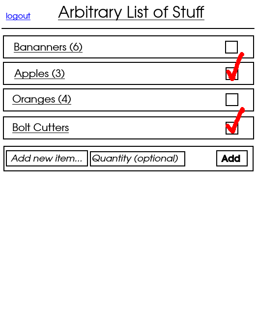

# Shopping List

_Web based shopping/todo style list application. Data is unique to each user._

## Wireframe

## Plan

1. html/css layout basics
2. write renderItem, displayList functions with fake local data, test displaying/rendering works fine
3. make/configure the actual table i need using supabase web interface
4. write fetch functions (fetchList, addItem, markItem, clearList, in that order), test

## HTML
### auth page

    - login form (email text box, password text box, submit button)
    - sign up form (email text box, password, text box, submit button)

### list page

    - logout button
    - section for items in list (column flexbox container)
    - for each item:
        - container with item name, quantity, checkbox to mark items complete
        - container changes color and style to reflect if complete or not
    - add new item menu as last item of list
        - contains text entry box, quantity text entry box, "add" button
    - at bottom of page, as footer, delete all items button

## State

    - `items`: locally stored list of items, retrieved from database on page load and when anything changes

## Events
### auth page

    - on click login w/valid login info: authenticate via Supabase API, redirect to list page
    - on click signup w/valid signup info: auth via Supabase API, redirect to list page
    - if either fail: display appropriate error message
    - if already authenticated: redirect to list page

### list page

    - on page load: if not authenticated, redirect to auth page
    - on click logout: logout with Supabase API, redirect to auth page
    - on click list item: mark item in DB, pull updated data, update page
        - if already marked: unmark item in DB, pull updated data, update page
    - on click add item button: pull item name/quantity from form, update DB, pull updated data, update page

## Functions
### render functions

    - `renderItem(item)` - given item object, returns div for item for rendering to page

### display functions

    - `displayList` - iterates through `items`, renders to page

### fetch functions

    - `fetchList` - fetches all items added by user to list from DB, checking for errors
    - `addItem(item)` - pushes new item and quanitity if provided to DB
    - `markItem(id)` - marks item with id `id` in DB, if already marked, does nothing
    - `unmarkItem(id)` - unmarks item with id `id` in DB, if not marked, does nothing
    - `clearList` - removes all items from list in DB
